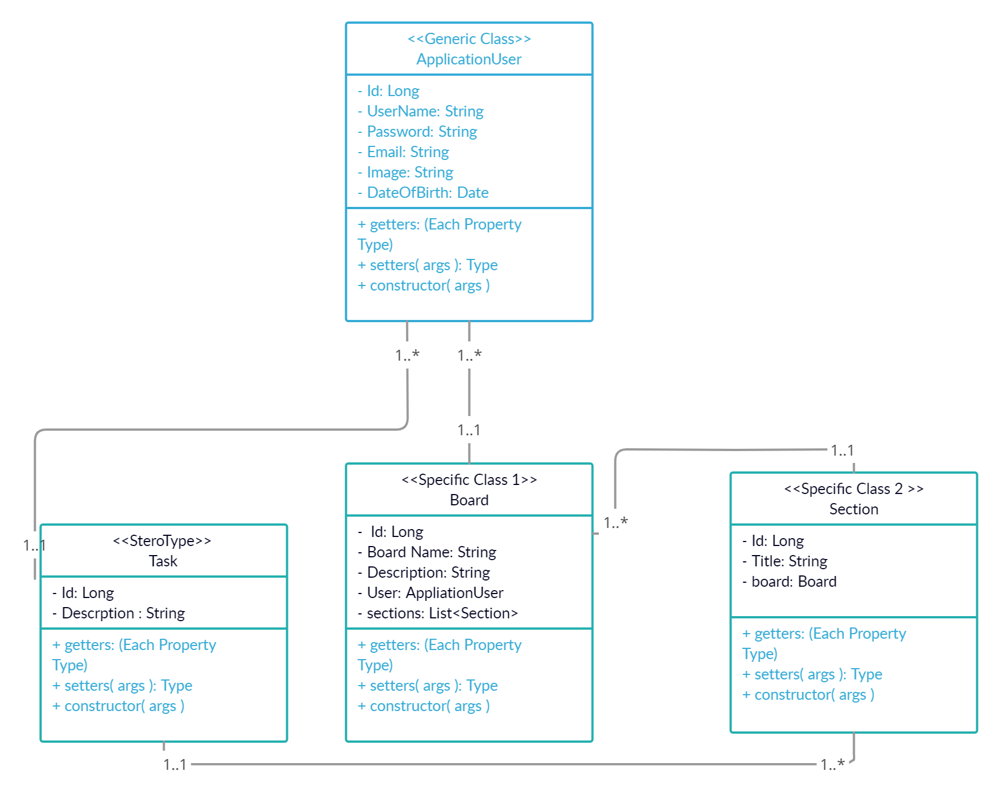

# Todo
# 401 Midterm Project

## Team Members

* Mohammed Mohiesen 
* Sufian Hamdan
* Mohammad jaradat
* Noor Jamal Hajbi
* Bayan Khalil

## Wireframes

## User Stories
### Feature Tasks:

* as a user I want the ability to sign up to use the features on website 
* log in on my acount 
* As a user, I want the ability to invite users on specific board
* add board with different section 
* specifyes the tasklist into to-do section
* move the taske between sections when it done or not 
* delete any task ,section and board

### Acceptance Tests:

1.Ensure that the boards and section and tasks successfully save into database

2.Provide error message and abort transaction if system becomes unavailable 

## Domain Modeling

## Problem Domain

To make an website where users can lists all of them tasks based on deadline date

## Instructions to run the website 

* 
* 
* 
* 
* 

## Work plan

* Work tasks will be sorted out at stand up and reassigned throughout the day as needed.
* Tasks will be updated and tracked .
* Code Review and daily prep at 9:00am
* Debrief before leaving for the day – 5:00pm.

## Git process

* Start in the same code base each morning.
* Pull Requests as needed (particularly for route setup) and done as a group.
* main branch will only be working versions.
* subbranchs is where we can break things.

## Daily Team Workflow
* 
* 
* 
* 
* 
